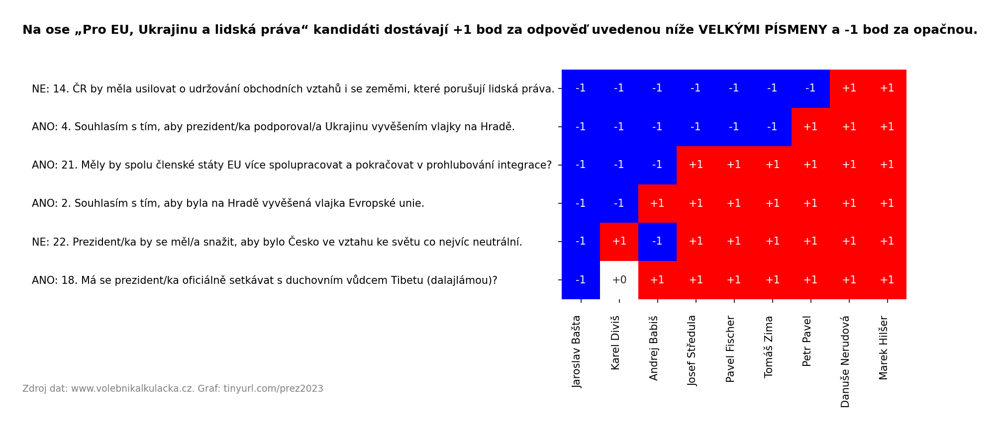

# Jaká úskalí má volební kalkulačka?

Volební kalkulačky počítají vaši shodu s kandidáty na předem vybraných otázkách. Kalkulačka na [volebnikalkulacka.cz](https://www.volebnikalkulacka.cz) vám také dovolí přiřadit dvojnásobnou váhu nebo otázku vynechat (nulová váha). I tak má několik úskalí:

1. **Kalkulačka ignoruje, že velká část otázek je logicky provázaná nebo alespoň korelovaná.** To si pravděpodobně uvědomí kandidáti, kteří své odpovědi promýšlí, ale možná ne vy, když musíte vybírat odpovědi sekvenčně v náhodném pořadí.

	> Odpověď ANO na „Prezident by měl mít pravomoc navrhovat zákony“ implikuje stejnou odpověď na „Prezident má mít širší pravomoci“. Postoj k prohlubování evropské integrace koreluje s postojem k vyvěšování vlajky EU.)
	

2. **Část odpovědí je spíše šum než užitečná informace.** Ideální by bylo takové otázky vynechat, ale to se vám pravděpodobně při vyplňování kalkulačky nepodaří napoprvé konzistentně.
	
	> Pokud máte názor na to, zda má prezdident co nejvíce jezdit na kole a MHD, možná tuto otázku nevynecháte, i když je to pro vás mnohem méně důležité než jeho názor na to, zda by prezidenta měl být trestně stíhatelný i v době výkonu mandátu.

Zkrátka odpovědi ve volební kalkulačce obsahují mnohem méně informací než se zdá, a přitom není snadné tyto informace efektivně získat.

To určitě není vše, ale už máme dvě věci, které se dají zlepšit.

# Jak vydolovat informace z dat z volební kalkulačky?

Pro nějakou výpovědní hodnotu je lepší související otázky interpretovat jako celek a šum ignorovat.

Z otázek, resp. odpovědí v kalkulačce pro prezidentské volby 2023 [volebnikalkulacka.cz](https://www.volebnikalkulacka.cz) jsem proto vybral dvě skupiny otázek, které mi přijdou vypovídající o kandidátech a zároveň logicky provázané/korelované uvnitř těchto skupin:

1. **Velké pravomoci a malá odpovědnost:** kandidáti dostávají +1 bod za odpovědi podporující široce pojaté prezidentské pravomoci (-1 za odpovědi proti) a -1 bod za odpovědi podporující trestní stíhatelnost/odpovědnost prezidenta (+1 za odpovědi proti).

2. **Pro EU, Ukrajinu a lidská práva:** kandidáti dostávají +1 bod za odpovědi podporující EU, Ukrajinu nebo lidská práva.

**Pozor:** Body nedávám za to, jak se mi odpověď líbí či nikoli, ale podle toho, ke kterému názorovému pólu směřuje. Příklad:

> „Prezident má mít povinnost jmenovat navržené soudce.“ ANO: -1, NE: +1
> „Prezident má udělovat milosti i nadále bez omezení.“ ANO: +1, NE: -1

Za chvíli se dostanu i k samotným otázkám a odpovědím na ně. Nejdříve se ale podívejme, jak z toho kandidáti vyšli:

Osy odpovídají výše vymezeným skupinám otázek (v každé skupině je jich 12, resp. 6).

Podívejme se tedy na odpovědi v první skupině. Barva nebo číslo zde znamená počet bodů (tedy názorový pól), nikoli polaritu odpovědi (ANO/NE):

Otázky i kandidáty jsem seřadil tak, aby byla vidět logická souvislost otázek. Zároveň je tak i dobře vidět, jak jsou extrémní (bez jakékoli urážky) kandidáti v odpovědích na některé otázky osamocení:

> Danuše Nerudová nejenže by pravomoci prezidenta pojala minimalisticky a aby se zodpovídal ze svých rozhodnutí (na čemž se s leckým shodne), ale je jediná, kdo by chtěla, aby prezident byl navíc trestně stíhatelný během výkonu mandátu.

> Jaroslav Bašta a Tomáš Zima jsou jediní dva, kteří nejenže se v jednotlivých otázkách vyjádřili pro maximalistický výklad pravomocí prezidenta, ale navíc explicitně řekli ANO na to, že „prezident by měl mít širší pravomoci“.

Je také vidět, že v jednom případě vyšlo kandidátům stejné skóre, přestože mají odlišné odpovědi v několika otázkách (Pavel a Hilšer). Celkově se ale ukazuje, že zdánlivě bohaté informace z mnoha odpovědí můžeme snadno zredukovat na číselné skóre, aniž bychom o mnoho přišli. (U DN, AB, PF bychom z jejich číselného skóre mohli přesně rekonstruovat odpovědi. U ostatních bychom se spletli v jedné otázce s čestnou výjimkou TZ.)

Tento graf stejným způsobem zobrazuje odpovědi na otázky, co spolu na první pohled ne vždy logicky nesouvisí, ale odpovědi opět tvoří jasnou hierarchii.

# Co to pro mě znamená jako pro voliče?

Mohlo by vám to pomoci z volební kalkulačky vytáhnout podstatné informace a odhlédnout od šumu.

Snadno uvidíte, jak jsou k sobě někteří kandidáti blízko (např. Hilšer, Fischer i Středula jsou velmi blízko k Pavlovi na obou osách) a můžete si i ověřit těch pár otázek, ve kterých se liší.

Je také zřejmé, že Danuše Nerudová je zvlášť v otázce pravomocí a odpovědnosti prezidenta tak důsledná, že je od všech kandidátů dále než Jaroslav Bašta na opačné straně spektra.

Nemyslím si ale rozhodně, že volič by měl redukovat kandidáty na nějaká skóre, a už vůbec ne, že malé rozdíly v těch číslech něco znamenají.

# Další otázky, na které se nikdo neptal

## Proč není zahrnuta otázka X? Kde je přehled všech otázek a odpovědí?

Některé otázky jsou podle mě spíše šum, některé jsou zajímavé, ale nedají snadno zahrnout do nějaké dost široké polarizované skupiny. Celý přehled odpovědí si můžete prohlédnout v [tabulce odpovědí](output/answers.csv), případně v [tabulce odpovědí s komentáři](output/answers-comments.csv). Opět připomínám, že zdrojem dat je web [volebnikalkulacka.cz](https://www.volebnikalkulacka.cz), tam ale odpovědi moc přehledně nenajdete.

## Není lepší proklikat se kalkulačkou?

Myslím, že kalkulačka je zajímavá tím, že vás samotné přiměje přemýšlet nad odpověďmi. Určitě se jí proklikejte na [volebnikalkulacka.cz](https://www.volebnikalkulacka.cz).

## Jak jsou ta data zpracovaná?

Zdrojový kód je [tu](president.py).

## To jakože programátor rozumí politice?

Ne. Proto se snažím toho tady o politice moc neříkat. Jsem [programátor](https://www.bestincovid.info) a doktorand v oboru Information Science na [NAIST](http://www.naist.jp), takže vím něco o informacích a šumu. I tak to ale berte spíš jako hříčku než nějakou analýzu.

## Můžu to sdílet?

Ano. Není to bůhvíco, takže jsem se neobtěžoval s nějakou licencí. Dělejte, co Vám přijde rozumné a slušné. Pokud to jde, odkazujte [sem](https://tinyurl.com/prez2023) i na [původní zdroj dat](https://www.volebnikalkulacka.cz). (Pokud budete sdílet obrázky, tak v nich odkazy malým písmem jsou.)